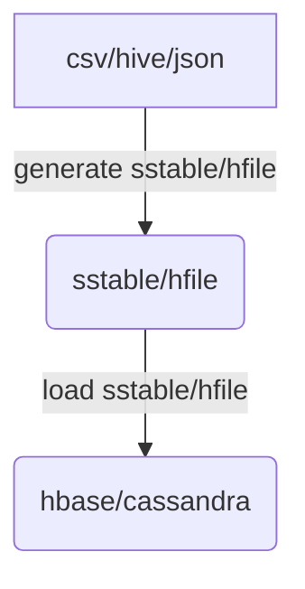
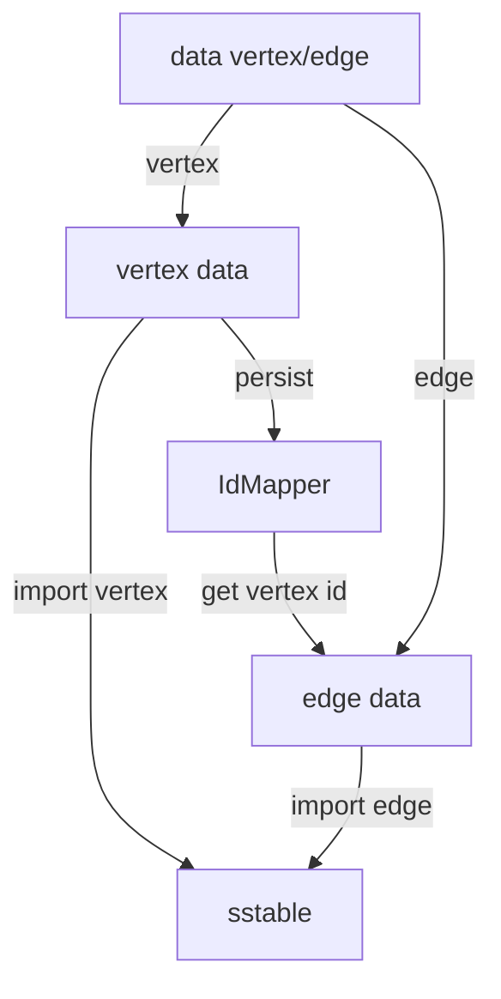
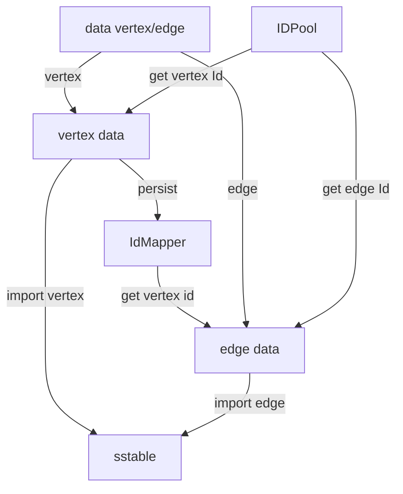

# bulk-load import in JanusGraph ([bulk-load](https://github.com/JanusGraph/janusgraph/issues/885))

## Introduction

https://github.com/dengziming/janusgraph-util

Currently, JanusGraph supports bulk load. if you wan't to load some data(e.g. csv data), you can do it following docs ([bulk-loading](https://docs.janusgraph.org/latest/bulk-loading.html)). you can follow the following steps:

1. create the schema of graph(e.g. PropertyKey, VertexLabel, EdgeLabel, GraphIndex). 
2. import vertex data into janusgrpah and remember the Mapper of value to JanusGrpahId.
3. join the edge data with Mapper of step2 .
4. import the result of step3 as edge data.

to improve the performance, you have some choices:
* Enabling the storage.batch-loading configuration.
* Set ids.block-size to the number of vertices you expect to add per JanusGraph instance per hour.
* Set ids.authority.wait-time and ids.renew-timeout .
* storage.buffer-size and storage.attempt-wait.
* Parallelizing the Load Set batch-loading=true.

give some expmples, here are three table, t_user contains the user info, t_item contains the item info, t_order contains which items each user bought:

t_user:

| userid | name | age |
| --- | --- | --- |
| 001 | json | 20 |
| 002 | mike | 18 |


t_item:


| itemid | itemname | itemprice |
| --- | --- | --- |
| 001 | paper | 1 |
| 002 | pen | 20 |
| 003 | box | 5 |

t_order:

| userid | itemid |  amount|
| --- | --- | --- |
| 001 | 001 | 10 |
| 001 | 002 | 2 |
| 001 | 003 | 1 |
| 002 | 001 | 100|

we wan't to import the data into janusgraph, firstly we create the schema, and then we can import user and item to janusgraph and generate to id table to remember the Mapper of value to janusgrpahId, and the id table are as follows:

t_user_id:

| userid | janusgraphId |
| --- | --- |
| 001 | 001 |
| 002 | 010 |

t_item_id:


| item_id | janusgraphId |
| --- | --- |
| 001 | 011 |
| 002 | 100 |
| 003 | 101 |

and the we can join the edge data with the id data:

```sql
create table t_order_id as
select 
    b.janusgraphId as userid,
    c.janusgraphId as itemid,
    a.amount as amount
from
    t_order a
inner join
    t_user_id b
on
    a.userid=b.userid
inner join
    t_item_id c
on
    a.itemid=c.itemid
```
and then 


but it's still not fast enough, here are some data from production:

3 machines of cassandra(56vcore, 256G memory), 1 billion vertices, 10 billion edges, 30h.


## Definition of problem
The goal of this project is to load data into janusgraph fastly. we won't load data into cassandra directly but devided it into 2 parts, first is to generate sstable/hfile, and the second is load sstable/hfile data into cassandra/hbase.



so we just need to make some changes of the original Janusgraph write api to write JanusGraphVertex or JanusGraphEdge to sstable/hfile instead of hbase/cassandra. here are the basic steps to generate sstable/hfile:

1. create `JanusGraphVertex` or `JanusGraphEdge`, then serialize them using the `EdgeSerializer`.
2. use `SSTableLoader` provided by cassandra to generate sstable.


as we know, every time we new `JanusGraphVertex` or `JanusGraphEdge`, we need to get a Global uniqueness id from janusgraph, and janusgraphId is allocated one by one, so we can rewrite the `IDPool` to allocate id fastly.

when new a `JanusGraphEdge`, we also need to get the start and end `JanusGraphVertex`? in the ([bulk-loading](https://docs.janusgraph.org/latest/bulk-loading.html)), we use join to get the start and end JanusgraphId, but we can use some more effectively method. when new JanusGraphVertex, we should persist the value and the id in IdMapper(e.g. HashMap), then we can get the startId from the map according to value of startNode, so we need a idMapper to keep track of the vertex primary key value and its janusgraph id.




if we add the IDPool of janusgraph, the graph is:



### Assumptions of the project:

* this can be used when first insert to janus, and it only support cassandra 
* this is not thread safe
* this is not transaction, which means this doesn't promise ACID
* No constraint is imposed when import data
* if a error occur, the data is unusable
* just import nodes and relationships, index will not take efforts, you should use janusgraphManagement to do it
* not using Thrift , so the edition between cassandra and janusgraph should be consistent. for example ,if you are using cassandra 2.0 ,you should use janusgraph 2.X


### Components needed for bulk loading
In order to provide bulk loading the following components are needed. The interaction between these components can be seen in the following picture.

* A "IdAssainger" component is needed to assin janusgraph id. this component

* A "IdAssainger" component is needed to assin janusgraph id. this component


